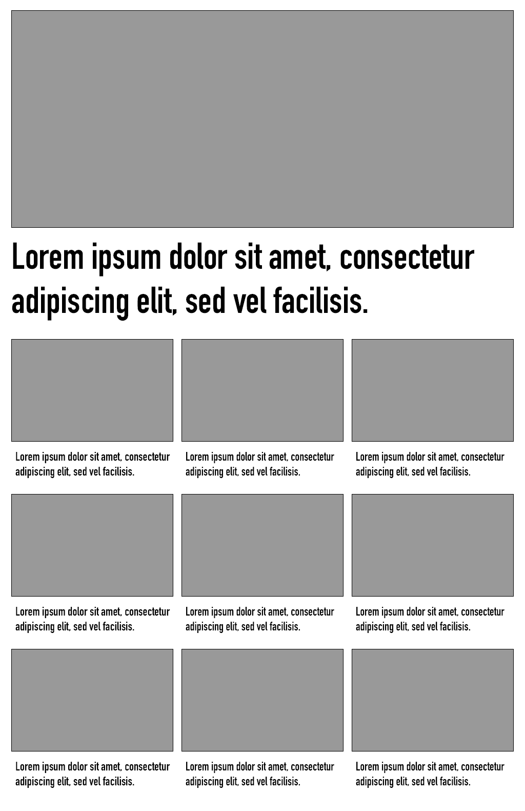
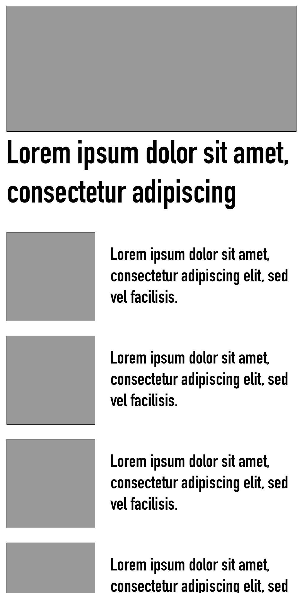

# CASE: Lag en forside

I dette caset skal du lage en forside for en nettavis. Forsiden skal være i form av en [Amedia Component](https://amedia.slite.com/app/docs/fs~VBEBXM3/Amedia-Component). En Amedia Component består av et manifest som beskriver et endepunkt som leverer HTML og hvilke parametre som skal sendes inn til dette endepunktet. Videre inneholder manifestet url'er til evt. script- og css-filer. I dette caset ligger det allerde klart en fungerende Amedia Component du kan arbeide videre på.

## Sett opp miljøet

Det første du må gjøre er å sette opp miljøet.

1. Lag en klone av dette repository
2. Du må ha Node versjon 18 for å kjøre applikasjonen
3. Installer avhengigheter med `npm install` og kjør opp serveren med `npm run dev-start`
4. Du skal nå få opp [en nettside](http://localhost:8080/frontpage-case/preview)

## Lag en forsidekomponent

I filen [src/views/preview.view.js](src/views/preview.view.js) vil du se to [custom elements](https://developer.mozilla.org/en-US/docs/Web/Web_Components). Custom elementet `<amedia-include>` er en klient som lar deg inkludere Amedia Components. Attributtet `manifest` er url'en til komponentens manifest. Eventuelle parametre sendes inn med attributter som prefikset med `param-`. Her ser du at den første peker til en header-komponent som skal ha parameteret `publication`. 

Den andre komponenten har manifestet [http://localhost:8080/frontpage-case/manifest](http://localhost:8080/frontpage-case/manifest). Hvis du ser i manifestet, ser du at det referes til urlTemplate og til css/js-filer. 

`urlTemplate` er en url som leveres av denne serveren og som du kan finne definert i [src/routes/router.js](src/routes/router.js). 

Du finner en javascript og CSS-fil i mappen `public`. 

## Oppgaven

Du skal utføre følgende i prioritert rekkefølge. Du kan installere de pakkene du ønsker og står fritt til å løse oppgaven slik du selv vil. Dette inkluderer at du kan velge å skrive om koden i dette caset om du ønsker det.

1. Komponenten skal hente de siste publiserte sakene på en publikasjon via [https://services.api.no/api/acpcomposer/v1.1/search/content/?publicationDomain=www.ba.no&sort=lastPublishedDate&types=story](https://services.api.no/api/acpcomposer/v1.1/search/content/?publicationDomain=www.ba.no&sort=lastPublishedDate&types=story) og du skal tegne ut en forside med teasere. En teaser er bilde og tittel fra nyhetssakene med lenke til artikkelen. Her må du gå litt på jakt i responsen fra API-kallet. Du kan bruke bildet som ligger under `fields.versions.large` i JSON-objektet selv om bildet er litt stort. Du bestemmer selv om du vil tegne ut komponenten serversidet eller clientsidet, men vi vil gjerne at du forteller oss hvorfor du velger en serversidet eller klientsidet rendring.

2. Filtrer bort alle teasere som ikke har bilde.

3. Preview-routen i serveren skal endres slik at den tar publikasjonen (f.eks. www.ba.no) som query-parameter og lar deg dermed velge hvilken forside du skal se.

## Design

Vi ønsker at layouten skal se slik ut på store skjermer:

...og slik på mindre skjermer:

 Breakpoints legges der layout brekker. Tross alt derfor det heter "breakpoints".

 Maksbredde skal være 980px for innholdet. Du velger selv font, fontstørrelse, linjehøyde, padding etc.

 ## Innlevering

 Caset skal enten leveres som en pull request til dette repo'et, eller ved å sende oss en lenke til repo'et ditt.
